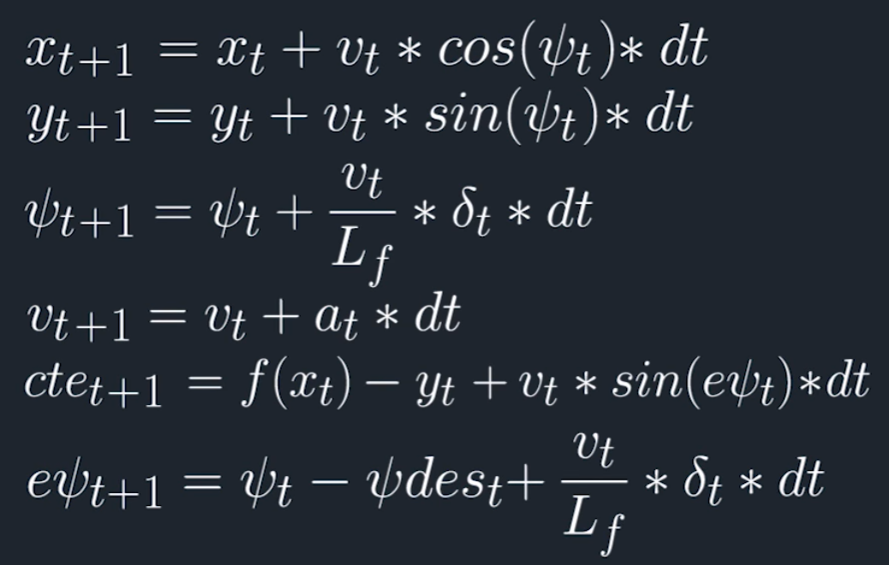

# Rubric points

## 1. Model description:

The vehicle model used in this project is a simple Kinematic model. It ignores tire force, gravity, air resistance/drag, geometry of the vehicle and vehicle mass. Since all above mentioned factors are not avaiblable in the simulator, the simple Kinematic model is sufficient for this project. (Although in realistic sccenario dynamic model is much appropriate)

The vehicle kinematic model can be described with 2D cartesian coordinates, steering angle, vehicle velocity and their respective errors. The model combines the vehicle states and actuations from previous timestep to calculate the current states, based on the following equations:

<p align="center"><p align="center">

Where `delta_t` in third equation represents the actuation change in steering angle, `a_t` in the speed equation represents the acceleration actuation, andd `ψ_des_t` denotes the desired ψ.

Note that the steering angle actuation `delta_t` are constrained within [-25, 25] degree, and the acceleration actuation `a_t` is constrainted within [-1, 1] where `1` represents full on acceleration, `-1` represents full on brake.

The goal is use such model to have the vehicle driving along the desired path. It is achieved by minimizing cost that consists of the Cross-Track-Error and Steering-Error calculated from above equations. 

## 2. Timestep length and Elapsed Duration (N & dt):
The value chosen for N and dt are 15 and 0.1. `dt` is set to 100ms because it is roughly the time delay in realistic scenarios for modern vehicles. I set `N` = 15 simply beccause this produces better result given the top speed I have chosen (`Vmax` = 60 mph). 

These value mean that the solver is considering 1.5 seconds duration in which to determine a corrective trajectory. 

Other value tried: N = [25, 20, 18, 10]. 10 steps are too short to produce ideal value when the vehicle is running fast, opposite is true for N > 18. 

## 3. Polynomial Fitting and MPC preprocessing

The waypoints were preprocessed through perspective transformation such that the vehicles's coordinates are now centered at the origin, simplifies the calculation process. 

<pre><code>// Perspectove transformation such that the reference system is set at origin:
// ie: px = 0, py = 0, psi = 0
for (int i = 0; i < ptsx.size(); i++)
{
    double shift_x = ptsx[i] - px;
    double shift_y = ptsy[i] - py;
    waypoints_x.push_back(shift_x * cos(-psi) - shift_y * sin(-psi));
    waypoints_y.push_back(shift_x * sin(-psi) + shift_y * cos(-psi));
}

// Conversion to Eigen::VectorXd
double *ptrx = &waypoints_x[0];
double *ptry = &waypoints_y[0];
Eigen::Map<Eigen::VectorXd> waypoints_x_transform(ptrx, 6);
Eigen::Map<Eigen::VectorXd> waypoints_y_transform(ptry, 6);
</code></pre>

Then a 3rd degree polynomial is fitted to the transformed waypoints before feeding into the solver:

<pre><code>// Find coeffs of a 3rd order polynomial
auto coeffs = polyfit(waypoints_x_transform, waypoints_y_transform, 3);
double cte = polyeval(coeffs, 0);
double epsi = -atan(coeffs[1]);
</code></pre>

Then use the coefficients found from the polynomial to predict a trajectory

<pre><code>// State values
Eigen::VectorXd state(6);
state << 0, 0, 0, v, cte, epsi;
auto vars = mpc.Solve(state, coeffs);
</code></pre>


## 4. Model Predictive Control with Latency
The mechanism to deal with the latency is quite simple. Since the time duration is set to 100ms, and from previous section we have discussed that for modern vehicle the actuation delay is roughly around 100ms, thus the current actuation is delayed to the next timestep. In the code, actuations from previous step is used for the current evalutation: 

<pre><code>// use previous actuations (to account for latency)
if (t > 1)
{
    a0 = vars[a_start + t - 2];
    delta0 = vars[delta_start + t - 2];
}
</code></pre>

As for the control itself, we use the solver to produce the control input such that the vehicle follows the reference trajactory when the cost is minimized. 

<pre><code>// The part of the cost based on the reference state.
for (size_t t = 0; t < N; t++)
{
    fg[0] += cte_weight * CppAD::pow(vars[cte_start + t], 2);
    fg[0] += epsi_weight * CppAD::pow(vars[epsi_start + t], 2);
    fg[0] += v_weight * CppAD::pow(vars[v_start + t] - ref_v, 2);
}

// Minimize change-rate.
for (size_t t = 0; t < N - 1; t++)
{
    fg[0] += actuator_weight * CppAD::pow(vars[delta_start + t], 2);
    fg[0] += actuator_weight * CppAD::pow(vars[a_start + t], 2);
    // Adding additional penalty for speeding while steering
    fg[0] += speed_turn_weight * CppAD::pow(vars[delta_start + t] * vars[v_start + t], 2);
}

// Minimize the value gap between sequential actuations.
for (size_t t = 0; t < N - 2; t++)
{
    fg[0] += steering_weight * CppAD::pow(vars[delta_start + t + 1] - vars[delta_start + t], 2);
    fg[0] += acceleration_weight * CppAD::pow(vars[a_start + t + 1] - vars[a_start + t], 2);
}
</code></pre>

## 5. Final video demonstration

[link](https://youtu.be/aRncBcHTjS8)

Note: I apologize for uploading video in cellphone format. But my processor is not fast enough to conduct a video recording without messing up the MPC proccessing, so I recorded the run using my cellphone.

I included the compiled app in the build folder as well


---
# How to run

## Dependencies

* cmake >= 3.5
 * All OSes: [click here for installation instructions](https://cmake.org/install/)
* make >= 4.1(mac, linux), 3.81(Windows)
  * Linux: make is installed by default on most Linux distros
  * Mac: [install Xcode command line tools to get make](https://developer.apple.com/xcode/features/)
  * Windows: [Click here for installation instructions](http://gnuwin32.sourceforge.net/packages/make.htm)
* gcc/g++ >= 5.4
  * Linux: gcc / g++ is installed by default on most Linux distros
  * Mac: same deal as make - [install Xcode command line tools]((https://developer.apple.com/xcode/features/)
  * Windows: recommend using [MinGW](http://www.mingw.org/)
* [uWebSockets](https://github.com/uWebSockets/uWebSockets)
  * Run either `install-mac.sh` or `install-ubuntu.sh`.
  * If you install from source, checkout to commit `e94b6e1`, i.e.
    ```
    git clone https://github.com/uWebSockets/uWebSockets
    cd uWebSockets
    git checkout e94b6e1
    ```
    Some function signatures have changed in v0.14.x. See [this PR](https://github.com/udacity/CarND-MPC-Project/pull/3) for more details.

* **Ipopt and CppAD:** Please refer to [this document](https://github.com/udacity/CarND-MPC-Project/blob/master/install_Ipopt_CppAD.md) for installation instructions.
* [Eigen](http://eigen.tuxfamily.org/index.php?title=Main_Page). This is already part of the repo so you shouldn't have to worry about it.
* Simulator. You can download these from the [releases tab](https://github.com/udacity/self-driving-car-sim/releases).
* Not a dependency but read the [DATA.md](./DATA.md) for a description of the data sent back from the simulator.


## Basic Build Instructions

2. Make a build directory: `mkdir build && cd build`
3. Compile: `cmake .. && make`
4. Run it: `./mpc`.
